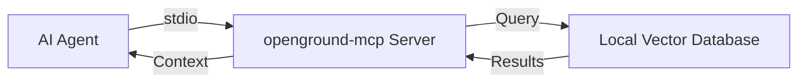

# MCP Server Overview

OpenGround provides a Model Context Protocol (MCP) server that enables AI agents to search your local documentation database in real-time.

## What is MCP?

The [Model Context Protocol](https://modelcontextprotocol.io) is an open protocol that standardizes how AI applications provide context to Large Language Models (LLMs). It enables secure, controlled access to data sources through a client-server architecture.

## How OpenGround Uses MCP

OpenGround implements an MCP server (`openground-mcp`) that exposes three powerful tools to AI agents:

<CardGroup cols={3}>
  <Card title="search_documents_tool" icon="magnifying-glass">
    Search documentation using semantic search and BM25 hybrid retrieval
  </Card>
  <Card title="list_libraries_tool" icon="list">
    View all available libraries and versions in your local database
  </Card>
  <Card title="get_full_content_tool" icon="file">
    Retrieve complete page content from search results
  </Card>
</CardGroup>

### Server Architecture

The MCP server runs as a subprocess managed by your AI agent. Communication happens over stdio (standard input/output), which provides:

- **Security**: No network exposure, runs locally only
- **Performance**: Direct process communication with zero network latency
- **Simplicity**: No ports, no authentication, no TLS configuration



## Benefits

### 1. Real-Time Documentation Access

Instead of relying on the AI's training data (which may be outdated), agents can query the latest official documentation from your local database.

### 2. Isolated Context

Documentation searches run in a separate context, preventing your main conversation from being cluttered with search results.

### 3. Offline Operation

Once documentation is indexed, all searches work completely offline—no API calls, no rate limits.

### 4. Version-Specific Results

Search documentation for specific library versions, ensuring compatibility with your project dependencies.

### 5. Multi-Library Support

Index and search documentation from multiple frameworks simultaneously:

```bash
# Add multiple libraries
openground add react --source https://github.com/facebook/react.git --docs-path docs -y
openground add fastapi --source https://github.com/tiangolo/fastapi.git --docs-path docs -y
openground add django --source https://github.com/django/django.git --docs-path docs -y
```

## MCP Tool Details

### search_documents_tool

Performs hybrid search (semantic + BM25) against your local documentation database.

**Parameters:**
- `query` (string): The search query
- `library_name` (string): Which library to search (e.g., "react", "fastapi")
- `version` (string): Library version (e.g., "latest", "v18.2.0")

**Returns:** Markdown-formatted results with relevant chunks, scores, and source URLs

### list_libraries_tool

Lists all documentation libraries and their versions available in your local database.

**Parameters:** None

**Returns:** Dictionary mapping library names to lists of available versions

```json
{
  "react": ["latest"],
  "fastapi": ["latest", "v0.109.0"],
  "django": ["latest", "v5.0"]
}
```

### get_full_content_tool

Retrieves the complete content of a documentation page by URL.

**Parameters:**
- `url` (string): The page URL from search results
- `version` (string): Library version

**Returns:** Full page content in markdown format

## Agent Workflow

When you ask an AI agent about a library, the typical workflow is:

<Steps>
  <Step title="Check Available Libraries">
    Agent calls `list_libraries_tool` to see what documentation is available
  </Step>
  <Step title="Search Documentation">
    Agent calls `search_documents_tool` with your query, library name, and version
  </Step>
  <Step title="Present Results">
    Agent shows you relevant snippets with source URLs
  </Step>
  <Step title="Fetch Full Content (Optional)">
    If needed, agent calls `get_full_content_tool` to get complete page content
  </Step>
</Steps>

## Server Configuration

The MCP server uses your OpenGround configuration:

```bash
# View current configuration
openground config show

# Configure search settings
openground config set query.top_k 10

# Configure embedding model
openground config set embeddings.model_name "sentence-transformers/all-MiniLM-L6-v2"
```

## Performance Optimizations

The `openground-mcp` server includes several optimizations:

1. **Background initialization**: Embedding models are loaded in a background thread
2. **Cache warming**: Metadata is pre-cached on startup
3. **Minimal logging**: Stdout pollution is suppressed for clean stdio communication

## Next Steps

<CardGroup cols={2}>
  <Card title="Install for Claude Code" icon="code" href="/integration/claude-code">
    Set up OpenGround with Claude's AI agent
  </Card>
  <Card title="Install for Cursor" icon="cursor" href="/integration/cursor">
    Configure OpenGround in Cursor's mcp.json
  </Card>
  <Card title="Install for OpenCode" icon="terminal" href="/integration/opencode">
    Add OpenGround to OpenCode's config
  </Card>
  <Card title="Custom Agents" icon="robot" href="/integration/custom-agents">
    Manual configuration for other MCP clients
  </Card>
</CardGroup>